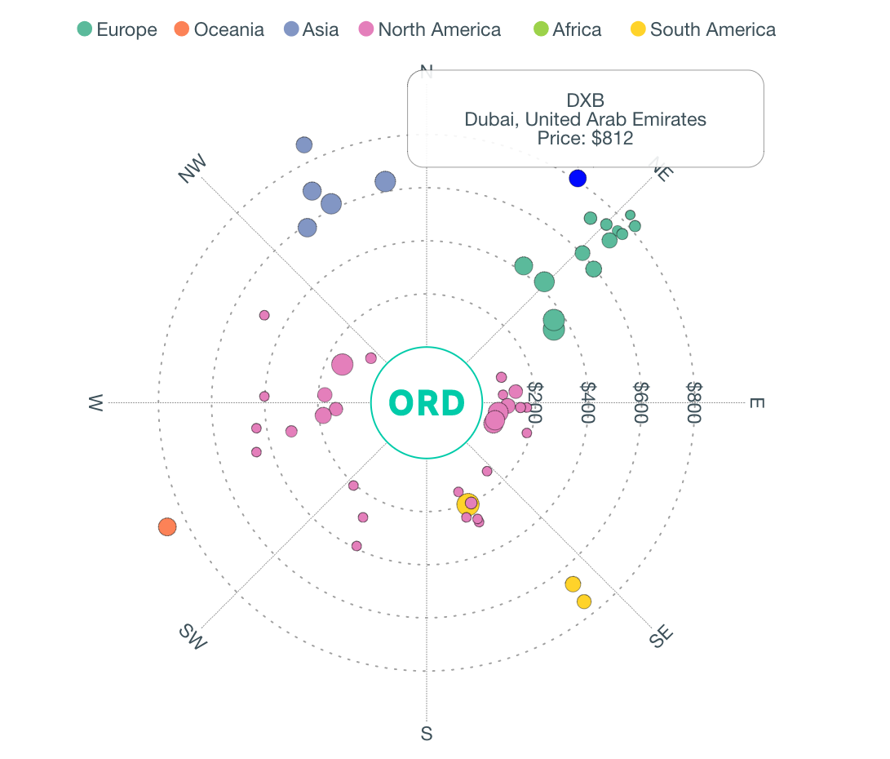

## Tech Stack

Express, Sequelize, PostgreSQL, GraphQL, PostgraphQL, React, Redux, Apollo, Victory Charts (D3), MapBox, Bulma

# getAway

getAway is a travel-recommendation app that helps users find places to travel to within their given budgets.

* **Price Map** displays the distance between the origin airport and destination airport as the price of a flight to get there. The orientation reflects the geographic bearing. The color reflects the continent. The size reflects the cost / km.

* **Geographic Map** colors the world map based on the cost to get to a particular region.

* **Trip Planner** lets you plan a trip by selecting airports, adjusting departure dates, purchase tickets and review your itinerary.

This project was designed and implemented by [Tim Shuo](https://github.com/theshuo/), [Ashish Malav](https://github.com/AshishDev17), [Joon Kim](https://github.com/kimj3), and [Finn Terdal](https://github.com/fterdal) as a Capstone project at [Fullstack Academy](https://www.fullstackacademy.com/). You can view our presentation [here](https://youtu.be/bfpKX1Fany0).


## Screenshot




## Getting Started

1. Clone (or fork) the repository:
    
    `git clone https://github.com/team-scissors/getaway/`

2. Install the necessary packages:

    `npm install` or `yarn`

3. Create a secrets file. This is used for Google OAuth login/signup. If you want to get up and running as quickly as possible, create a secrets.js file (at the top level of the repo) and initialize it like so:

    `touch secrets.js`

    secrets.js:

	```javascript
	process.env.GOOGLE_CLIENT_ID = 'My Favorite Client ID';
	process.env.GOOGLE_CLIENT_SECRET = 'Shhh, this is a client secret';
	process.env.GOOGLE_CALLBACK = '/auth/google/callback';
	```

	To make Google OAuth work, [go get a client id from Google](https://developers.google.com/identity/sign-in/web/devconsole-project).

4. Run the project in development mode:

	`npm run start-dev`
	
5. Create and seed the database. (This could take a while. Go grab a coffee)

	`createdb getaway && npm run seed`

6. Run the tests

	`npm test`
